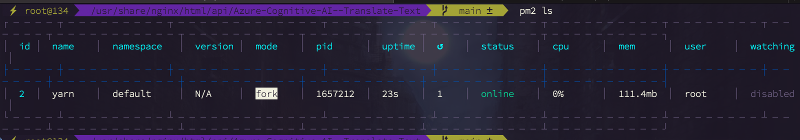

# Murtadha's Implementation of Translator API Using Azure Cognitive Services


## Description
This Project is created to serve as a connector between Azure Translate and a Client Application. It is a REST API that can be used to translate text from one language to another. It is built using Node.js and Express.js. It uses Azure Cognitive Services to translate the text. It is deployed on Azure App Service.

---
<a href="http://findasnake.com"></a>

## Quick Links
- [x] [API Playground](http://api.findasnake.com/api-docs/)

- [x] [Client App Example](http://api.findasnake.com/)

- [x] [Backup Server](api.findasnake.com/)

## Demo

---
<a href="http://findasnake.com"></a>

#### Client App Demo
 

#### API Playground Demo


#### State


## Table of Contents
- [ ] [Description](#description)
  - [ ] [Quick Links](#quick-links)
  - [ ] [Table of Contents](#table-of-contents)
- [ ] [Features](#features)
- [ ] [Getting Started](#getting-started)
  - [ ] [Dependencies](#dependencies)
  - [ ] [Running the Program](#running-the-program)
  - [ ] [Environment Variables](#environment-variables)
- [ ] [Endpoints](#endpoints)
  - [ ] [Using the API (Example)](#using-the-api-example)
  - [ ] [Example Request Query](#example-request-query)
  - [ ] [Example Response](#example-response) 
- [ ] [Authors](#authors)
- [ ] [License](#license)

## Text translation features

The following methods are supported by the Text Translation feature:


  - Translate: Renders single source-language text to multiple target-language texts with a single request
  
- Transliterate: Converts characters or letters of a source language to the corresponding characters or letters of a target language
-  Detect: Returns the source code language code and a boolean variable denoting whether the detected language is supported for text translation and transliteration
-   Dictionary lookup: Returns equivalent words for the source term in the target language
 


## Getting Started

---
<a href="http://findasnake.com"> </a>

### Dependencies

- [ ] Node.js
- [ ] Azure Cognitive Services (API Key and Endpoint)
- [ ] Azure App Service (Optional)
- [ ] Postman (Optional)

### Running the program
```bash
git clone repo && cd repo
npm install
npm start
```
### Environment Variables
```bash
TRANSLATOR_TEXT_REGION="<REGION>" #This is the region that is used to translate the text. It should be in the format "region" e.g. "eastus

TRANSLATOR_TEXT_RESOURCE_KEY="<API KEY>" # This is the API key that is used to authenticate the user

TRANSLATOR_TEXT_ENDPOINT="https://api.cognitive.microsofttranslator.com" # This is the endpoint that is used to translate the text

SECRET="<SECRET>" # This is the secret key that is used to authenticate the user
```

### Endpoints
---
<a href="http://findasnake.com">
</a>


| Endpoint           | Description                                                             |
| ------------------ | ----------------------------------------------------------------------- |
| `GET /languages`   | Returns the list of languages supported by the API                      |
| `POST /translate`  | Translate specified source language text into the target language text. |
| `POST /dictionary` | alternatives for single word translations.                              |
| `POST /detect`     | Identify the source language.                                           |
| `POST /transliterate`      | Transliterate text from one script to another.. |


### Using the API (Example)
---
<a href="http://findasnake.com"></a>

The API can be used by sending a POST request to the endpoint. The request body should be in JSON format and should contain the following fields:
- [ ] `text`: The text to be translated

- [ ] `to`: The language to translate to

- [ ] `from`: The language to translate from (Optional) 


### Example Request Query

```json
{
    "text": "Hello World",
    "to": "ar",
    "from": "en"
}
```

### Example Response
```javascript
{

[{"translations":[{"text":"أهلًا وسهلًا","to":"ar"}]}]

}
```


## Author
---
<a href="http://findasnake.com"></a>

### Murtadha Marzouq


